<div align="center">


[](https://git.io/typing-svg)

<br/>

[](http://www.linkedin.com/in/niranjan-rao-annavarapu)
[](https://niranjan.cloud)
[](mailto:niranjanannavarapu@gmail.com)
[](https://hub.docker.com/u/niranjan46)
[](https://x.com/niranjanan28651)

</div>

---

## 🧑‍💻 About Me

```yaml
name: Niranjan Rao Annavarapu
role: DevOps Engineer @ Dyashin TechnoSoft Pvt. Ltd.
experience: 2 years
location: Bengaluru, India

current_focus:
  - Managing 12 production apps across 24 environments (AWS + GCP)
  - 8-stage DevSecOps pipelines: build → SAST → DAST → Trivy → push → staging → gate → prod
  - 99.9% uptime | 65% reduction in manual deployment effort
  - Targeting Senior DevOps / SRE roles at product companies (15–25 LPA)

certifications:
  - AWS Certified Solutions Architect – Associate (valid Jan 2029)
  - Google Professional Cloud Architect (valid Feb 2028)
  - GitHub Foundations (valid Mar 2028)

credly: https://www.credly.com/users/niranjan-rao-annavarapu/badges
```

---

## 🏆 Certifications

<div align="center">

[](https://www.credly.com/users/niranjan-rao-annavarapu/badges)
[](https://www.credly.com/users/niranjan-rao-annavarapu/badges)
[](https://www.credly.com/users/niranjan-rao-annavarapu/badges)

</div>

---

## ⚡ Key Metrics

<div align="center">

| Metric | Value |
|--------|-------|
| 🚀 Production Applications Managed | **12 apps** |
| 🌍 Environments Managed | **24 environments** |
| ⏱️ Pipeline Execution Time | **20–40 min (8 stages)** |
| 📈 Manual Effort Reduction | **65%** via CI/CD automation |
| ✅ Production Uptime | **99.9%** |
| 👥 Developers Served | **10+ engineers** |
| 🔁 Deployment Frequency | **Multiple per day** |
| 🔐 Projects with Full DevSecOps | **4 projects** |

</div>

---

## 🛡️ DevSecOps Pipeline

```mermaid
flowchart LR
    A[📦 Build] --> B[🔍 SAST\nSonarQube]
    B --> C[🌐 DAST\nGitLab Built-in]
    C --> D[🐳 Trivy\nImage Scan]
    D --> E[📤 Push\nECR / GCR]
    E --> F[🧪 Deploy\nStaging]
    F --> G[✅ Manual\nApproval Gate]
    G --> H[🚀 Deploy\nProduction]

    style A fill:#1e3a5f,color:#fff,stroke:#4A9EFF
    style B fill:#1a4a2e,color:#fff,stroke:#4CAF50
    style C fill:#1a4a2e,color:#fff,stroke:#4CAF50
    style D fill:#1a4a2e,color:#fff,stroke:#4CAF50
    style E fill:#1e3a5f,color:#fff,stroke:#4A9EFF
    style F fill:#4a2e00,color:#fff,stroke:#FF9900
    style G fill:#4a1a1a,color:#fff,stroke:#f44336
    style H fill:#1a3a4a,color:#fff,stroke:#00BCD4
```



> Applied across: **Amrize (GCP)** • **DS Edify (AWS)** • **DS Jobby (AWS)** • **Holcim**

---

## 🛠️ Tech Stack

### ☁️ Cloud Platforms
<p>


</p>

### 🔁 CI/CD & DevSecOps
<p>


</p>

### 🐳 Containers & IaC
<p>


</p>

### 📊 Monitoring & Observability
<p>


</p>

### 🧰 Languages & Tools
<p>


</p>

---

## 📊 GitHub Stats

<div align="center">


</div>

<div align="center">

[](https://git.io/streak-stats)

</div>

<div align="center">

[](https://github.com/ashutosh00710/github-readme-activity-graph)

</div>

---

## 🏗️ Featured Projects

<div align="center">

[](https://github.com/niranjan-46)
[](https://github.com/niranjan-46)

</div>

---

## 🌐 Open for Collaboration

```
✅ Cloud Infrastructure Automation (AWS / GCP)
✅ DevSecOps Pipeline Design & Optimization
✅ Kubernetes & Container Orchestration
✅ Monitoring & Observability (Prometheus + Grafana)
✅ Infrastructure as Code (Terraform / Ansible)
✅ Short-term & long-term freelance DevOps projects
```

📩 **Reach out:** [niranjanannavarapu@gmail.com](mailto:niranjanannavarapu@gmail.com)

---

<div align="center">


[](https://github.com/niranjan-46)

*"Infrastructure is code. Reliability is a practice. Security is non-negotiable."*

</div>
